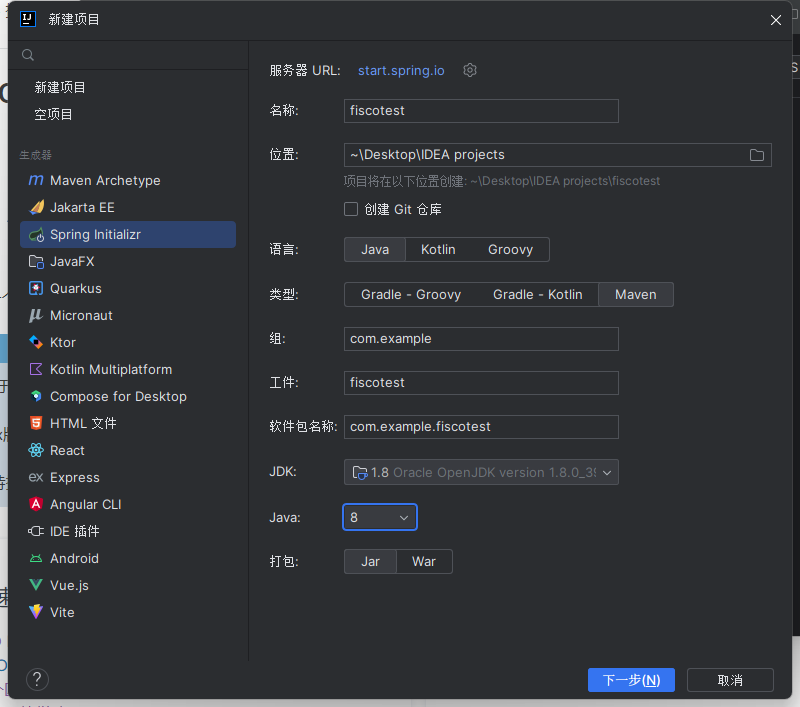
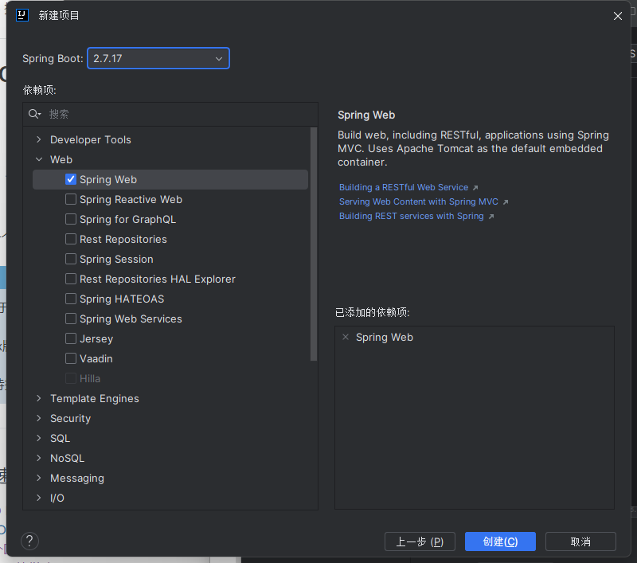
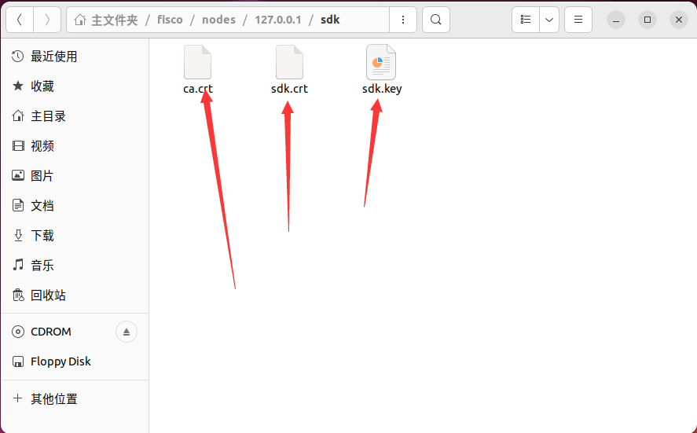
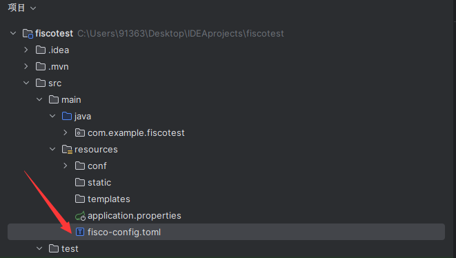
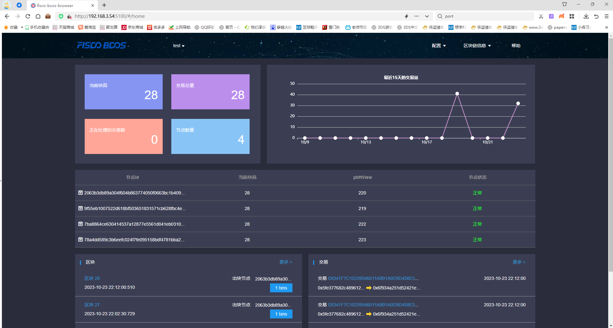
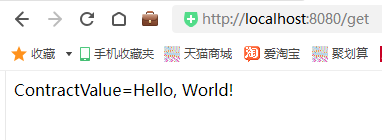
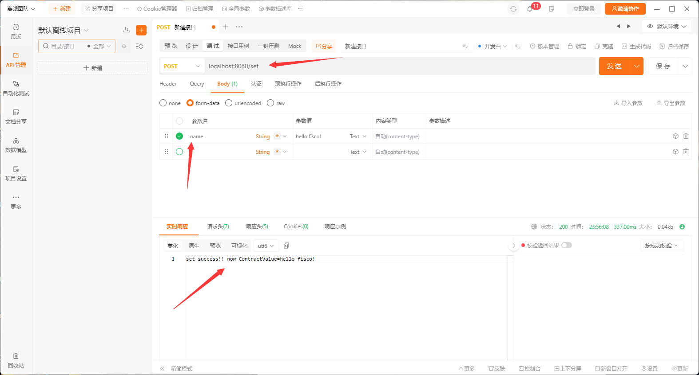

## 新建SpringBoot项目

- 使用IDEA新建一个SpringBoot项目，使用Maven来管理依赖，SpringBoot的依赖项选择Spring Web

## 添加FISCO BCOS区块链系统依赖

- 在pom.xml中添加FISCO BCOS区块链系统的Java SDK依赖

~~~xml
<dependency>
	<groupId>org.fisco-bcos.java-sdk</groupId>
	<artifactId>fisco-bcos-java-sdk</artifactId>
	<version>2.9.1</version>
</dependency>
~~~

## 拷贝区块链秘钥

- 在项目目录的resources下建立新文件夹conf

- 将“区块链文件夹/nodes/${ip}/sdk/”目录下的证书拷贝到conf文件夹中
- 我的区块链文件夹是fisco，部署的是本地四节点区块链，因此我这里的ip是127.0.0.1，文件夹下的证书如下

## 配置区块链系统

- 在项目的resources下创建配置文件 fisco-config.toml

- 下面给出fisco-config.toml的示例代码

~~~toml
[cryptoMaterial]
certPath = "conf"                           # The certification path  

# The following configurations take the certPath by default if commented
# caCert = "conf/ca.crt"                    # CA cert file path
# If connect to the GM node, default CA cert path is ${certPath}/gm/gmca.crt

# sslCert = "conf/sdk.crt"                  # SSL cert file path
# If connect to the GM node, the default SDK cert path is ${certPath}/gm/gmsdk.crt

# sslKey = "conf/sdk.key"                   # SSL key file path
# If connect to the GM node, the default SDK privateKey path is ${certPath}/gm/gmsdk.key

# enSslCert = "conf/gm/gmensdk.crt"         # GM encryption cert file path
# default load the GM SSL encryption cert from ${certPath}/gm/gmensdk.crt

# enSslKey = "conf/gm/gmensdk.key"          # GM ssl cert file path
# default load the GM SSL encryption privateKey from ${certPath}/gm/gmensdk.key

[network]
peers=["192.168.3.54:20200", "192.168.3.54:20201", "192.168.3.54:20202", "192.168.3.54:20203"]    # The peer list to connect

# AMOP configuration
# You can use following two methods to configure as a private topic message sender or subscriber.
# Usually, the public key and private key is generated by subscriber.
# Message sender receive public key from topic subscriber then make configuration.
# But, please do not config as both the message sender and the subscriber of one private topic, or you may send the message to yourself.

# Configure a private topic as a topic message sender.
# [[amop]]
# topicName = "PrivateTopic"
# publicKeys = [ "conf/amop/consumer_public_key_1.pem" ]    # Public keys of the nodes that you want to send AMOP message of this topic to.

# Configure a private topic as a topic subscriber.
# [[amop]]
# topicName = "PrivateTopic"
# privateKey = "conf/amop/consumer_private_key.p12"         # Your private key that used to subscriber verification.
# password = "123456"

[account]
keyStoreDir = "account"         # The directory to load/store the account file, default is "account"
# accountFilePath = ""          # The account file path (default load from the path specified by the keyStoreDir)
accountFileFormat = "pem"       # The storage format of account file (Default is "pem", "p12" as an option)

# accountAddress = ""           # The transactions sending account address
# Default is a randomly generated account
# The randomly generated account is stored in the path specified by the keyStoreDir

# password = ""                 # The password used to load the account file

[threadPool]
# channelProcessorThreadSize = "16"         # The size of the thread pool to process channel callback
# Default is the number of cpu cores

# receiptProcessorThreadSize = "16"         # The size of the thread pool to process transaction receipt notification
# Default is the number of cpu cores

maxBlockingQueueSize = "102400"             # The max blocking queue size of the thread pool

~~~

- 其中主要修改peers=["192.168.3.54:20200", "192.168.3.54:20201", "192.168.3.54:20202", "192.168.3.54:20203"]这一项，它代表你自己区块链中各个节点的ip和端口，由于我的区块链系统运行在虚拟机上，所以我这里填的是虚拟机的ip地址，如果节点运行在本机上，则这里的ip地址填写127.0.0.1

## 将智能合约转换成Java类

- 编写好的智能合约想在Java项目中使用则必须转换成Java类，FISCO BCOS系统给我们提供了转换脚本，但是我们需要先下载控制台

~~~bash
mkdir -p ~/fisco && cd ~/fisco
# 获取控制台
curl -#LO https://github.com/FISCO-BCOS/console/releases/download/v2.9.2/download_console.sh

# 若因为网络问题导致长时间无法执行以上命令，请尝试以下命令：
https://osp-1257653870.cos.ap-guangzhou.myqcloud.com/FISCO-BCOS/console/releases/v2.9.2/download_console.sh

bash download_console.sh

~~~

- 将需要使用到的Solidity智能合约放入fisco/console/contracts/solidity的目录。这里我使用console中的HelloWorld.sol作为例子。保证HelloWorld.sol在指定的目录下，然后进入目录fisco/console

~~~bash
# 进入目录~/fisco/console
cd ~/fisco/console
~~~

- 生成智能合约对应的Java类，这里需要根据使用的控制台版本来使用不同的命令

~~~bash
若控制台版本大于等于2.8.0：
# 使用sol2java.sh将contracts/solidity下的所有合约编译产生bin,abi,java工具类。
# 当前目录~/fisco/console
$ bash sol2java.sh -p org.com.fisco
# 以上命令中参数“org.com.fisco”是指定产生的java类所属的包名。
# 通过命令./sol2java.sh -h可查看该脚本使用方法

若控制台版本小于2.8.0：
# 使用sol2java.sh将contracts/solidity下的所有合约编译产生bin,abi,java工具类。
# 当前目录~/fisco/console
$ bash sol2java.sh org.com.fisco
# 以上命令中参数“org.com.fisco”是指定产生的java类所属的包名。
# ./sol2java.sh [packageName] [solidityFilePath] [javaCodeOutputDir]
~~~

- 将生成的Java类复制到项目中，所放的位置要与我们设定的包名相同

## 新建并编写控制器类

- 在项目中新建包controller，新建控制器类FiscoController，控制器代码如下

~~~java
package com.example.fiscotest.controller;

import com.example.fiscotest.HelloWorld;
import org.fisco.bcos.sdk.BcosSDK;
import org.fisco.bcos.sdk.client.Client;
import org.fisco.bcos.sdk.crypto.keypair.CryptoKeyPair;
import org.springframework.web.bind.annotation.GetMapping;
import org.springframework.web.bind.annotation.PostMapping;
import org.springframework.web.bind.annotation.RestController;

@RestController
public class FiscoController {
    public final String configFile = FiscoController.class.getClassLoader().getResource("fisco-config.toml").getPath();
    BcosSDK sdk =  BcosSDK.build(configFile);
    Client client = sdk.getClient(Integer.valueOf(1));

    HelloWorld helloWorld=null;
    @GetMapping("/deploy")
    public String deploycontract() throws Exception{
        CryptoKeyPair cryptoKeyPair = client.getCryptoSuite().getCryptoKeyPair();
        helloWorld = HelloWorld.deploy(client,cryptoKeyPair);
        return "deploy success!!";
    }

    @GetMapping("/get")
    public String getcontract() throws Exception{
        String value = helloWorld.get();
        return "ContractValue="+value;
    }

    @PostMapping("/set")
    public String setcontract(String name) throws Exception{
        helloWorld.set(name);
        String value = helloWorld.get();
        return "set success!! now ContractValue="+value;
    }
}

~~~

## 测试Java SDK

- 运行SpringBoot项目
- 进入虚拟机中运行区块链节点

- 进入区块链中运行区块链浏览器

- 在本机通过访问http://${虚拟机ip}:5100,成功进入区块链浏览器

- 在本机通过浏览器测试智能合约的部署

- 在本机通过浏览器测试智能合约名称的获取

- 在本机通过ApiPost测试智能合约名称的修改

- 经过以上测试之后刷新区块链浏览器，发现数据发生变化，Java SDK在我们的项目中成功的进行调用

